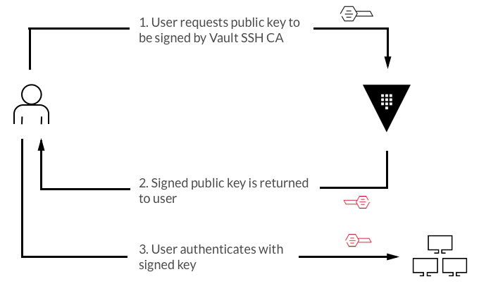

name: chapter-8
class: title, shelf, no-footer, fullbleed
background-image: url(https://hashicorp.github.io/field-workshops-assets/assets/bkgs/HashiCorp-Title-bkg.jpeg)
count: false

# Chapter 8
## SSH Secrets Engine

???

* Chapter 8 introduces Vault's SSH Secrets Engine.

---
layout: true

.footer[
- Copyright © 2019 HashiCorp
- 
]

---
name: Vault-SSH-Engine

# Vault SSH Engine - Certificate Signing
.center[]

* Manage the creation and authentication of SSH/TLS certificates
* Allow Vault to serve as a root or intermediate certificate authority

???
* There are two types of SSH engines within Vault
* The first we'll discuss is the certificate signing workflow
* Users will pass their local SSH keys to Vault to be signed
* Vault then returns a signed copy of that key
* Users can then use that key to access any machine configured to trust Vault as a CA

---
name: Vault-OTP-Engine

# Vault SSH Engine - One-Time Password (OTP)
.center[]

* Create a single use password to access machines
* Install the SSH helper on target machines

???
* The other option in Vault for SSH access is the One-Time Password engine
* It's a similar workflow as the previous example, but users will generate a single use password to gain access to target machines
* There is an SSH helper installed on the target machines that will validate the OTP and mark it as used
* This allows much more granularity when it comes to auditing because every login there is a call back to Vault which will show up in your audit logs, unlike the certificate signing where Vault is unaware when the signed key is used
* It also helps ensure that there are no longer lived keys out in the wild and you can specify short TTLs to the OTPs

---
name: Vault-SSH-Engine-1
# Vault SSH - Example Application

* In the next lab we'll use Vault's SSH engine to sign a local key.
* We'll use that signed key to SSH into a target instance.
* We'll also use Vault's SSH OTP engine to generate a single use password.
* Then we will use that OTP to log into a target instance.

???
* In this lab we will be using Vault's SSH engines in an example scenario.

---
name: lab-ssh-challenge-1
# 👩‍💻 Challenge 1: Enable the SSH Engine
* In this lab challenge, you'll enable the SSH engine.
* You'll do this in the [Vault SSH Engine](https://play.instruqt.com/hashicorp/invite/qleasfx1dszc) Instruqt track.
* Instructions:
  * Click the "Enable the SSH Engine" challenge of the "Vault SSH Engine" track.
  * Then click the green "Start" button.
  * Follow the challenge's instructions.
  * Click the green "Check" button when finished.

???
And this brings us to our next Lab:  "Vault SSH Secrets Engine"
* We will Enable the SSH Engine
* path "lob_a/workshop/ssh".

---
name: lab-ssh-challenge-2
# 👩‍💻 Challenge 2: Sign Key with SSH Engine and SSH to Target
* In this lab, you'll use Vault to sign a key with the SSH engine you enabled in the previous challenge and SSH into a target machine.
* Instructions:
  * If the track does not do it for you, click the "Sign Key with SSH Engine" challenge of the "Vault SSH Engine" track.
  * Then click the green "Start" button.
  * Follow the challenge's instructions.
  * Click the green "Check" button when finished.

???
* We'll sign a key with the SSH Engine and SSH into the target machine

---
name: lab-ssh-challenge-3
# 👩‍💻 Challenge 3: Enable the SSH OTP Engine
* In this lab challenge, you'll enable the SSH OTP engine.
* Instructions:
  * If the track does not do it for you, click the "Enable the SSH OTP Engine" challenge of the "Vault SSH Engine" track.
  * Then click the green "Start" button.
  * Follow the challenge's instructions.
  * Click the green "Check" button when finished.

???
We will enable the SSH OTP Engine.

---
name: lab-ssh-challenge-4
# 👩‍💻 Challenge 4: SSH Using SSH OTP
* In this lab, we'll use the OTP generated in the previous step to SSH into a target instance.
* Instructions:
  * If the track does not do it for you, click the "SSH Using SSH OTP" challenge of the "Vault SSH Engine" track.
  * Then click the green "Start" button.
  * Follow the challenge's instructions.
  * Click the green "Check" button when finished.

???
Then we'll SSH into a machine using the OTP.

---
name: chapter-8-review-questions
# 📝 Chapter 8 Review
* What is the main advantage of using Vault's SSH engine?
* What are some advantages and disadvantages of Certificate Signing vs One-Time Password?

???
* Let's review what we learned in this chapter.

---
name: chapter-8-review-answers
# 📝 Chapter 8 Review
* What is the main advantage of using Vault's SSH engine?
  * Allows you to have short lived SSH credentials preventing long lived SSH keys
* What are some advantages and disadvantages of Certificate Signing vs One-Time Password?
  * Certificate signing can use the built in OpenSSH functionality without the need to install Vault SSH-Helper
  * OTP gives insight when passwords are being used in Vault's audit logs
  * OTP are a single use password and therfore more secure

???
* Here are the answers to the review questions.