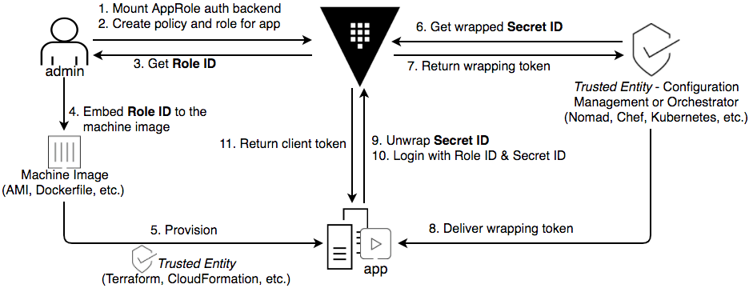

name: vault-workflow
class: title, shelf, no-footer, fullbleed
background-image: url(https://hashicorp.github.io/field-workshops-assets/assets/bkgs/HashiCorp-Title-bkg.jpeg)
count: false

# Vault Workflow
## Application delivery with Vault

???

* Overview of application delivery with Vault.

---
layout: true

.footer[
- Copyright © 2019 HashiCorp
- 
]

---
name: Vault-Workflow

# Application Delivery with Vault
.center[]

* Automate application delivery securely with Vault

???
